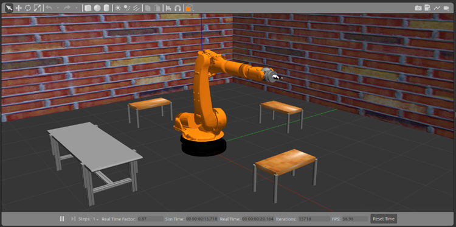
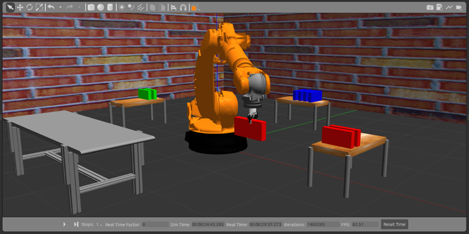

# KUKA Kr210 - Pick and Place

## Ubuntu and ROS Noetic installation

Ubuntu 20.04.6 / ROS Noetic

To test the operation of the KUKA Kr210 robot performing pick and place work, the following must be previously installed:

Ubuntu 20.04.6 LTS (Focal Fossa): [Official Ubuntu Documentation](https://releases.ubuntu.com/focal/). 

Before installing Ubuntu 20.04.6, you must install ROS Noetic following the documentation: [Official ROS Documentation](https://wiki.ros.org/noetic/Installation/Ubuntu).  

## Workspace creation steps for the project

~~~
mkdir -p ~/catkin_ws/src
cd ~/catkin_ws/src
catkin_init_workspace
cd ~/catkin_ws
catkin_make
~~~

_**Remember to add the workspace to the bashrc file so that ROS can know its jobs.**_

## Installation of libraries for correct operation

~~~
sudo apt update
sudo apt install ros-noetic-object-recognition-msgs
sudo apt install libopencv-dev python3-opencv
sudo apt install ros-noetic-cv-bridge
sudo apt install ros-noetic-joint-state-controller
sudo apt install ros-noetic-effort-controllers
sudo apt install ros-noetic-position-controllers
sudo apt-get install ros-noetic-ros-control ros-noetic-ros-controllers
sudo apt install ros-noetic-industrial-core
sudo apt install ros-noetic-moveit*
sudo apt install git
~~~

## Clone the current repository to test the project

~~~
cd ~/catkin_ws/src
git clone https://github.com/iesusdavila/kuka_kr210-pick-place.git
cd ~/catkin_ws
catkin_make
~~~

## Simulation

In the terminal you must execute the following launch to be able to initialize with the simulation in Gazebo

~~~
roslaunch kr210_gazebo kr210_gazebo.launch camera:=true gripper_2f:=true
~~~

In order to execute the pick and place functionality, the following launch must be executed

~~~
roslaunch kr210_master mov_pick_place.launch
~~~

## Authors

- [Iesus Davila](irdavila@espol.edu.ec)
- [Andrew Tomala](watomala@espol.edu.ec)
- [Miguel Jara](msjara@espol.edu.ec)

